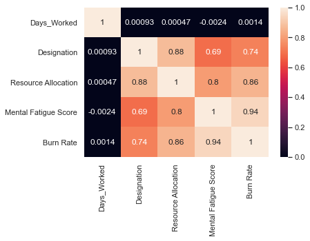
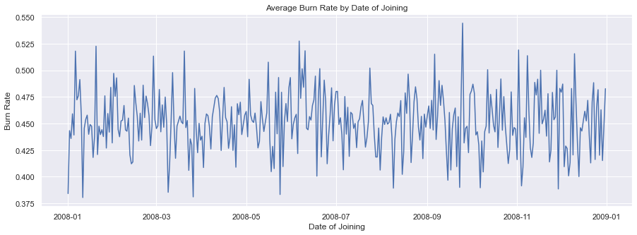

# Employee Fatigue EDA & Prediction

## Table of Contents

- [Background](#Background)
  - [Data Cleaning](#cleaning)
- [Findings](#Findings)
  - [correlation](#corr)
- [Usage](#Usage)

<a name="Background"/>

## Background

This data is from Kaggle found [here](https://www.kaggle.com/blurredmachine/are-your-employees-burning-out). The goal of this project was to see if we can find what variables affect employee burnout. After determining what variables are meaningful we need to see if we can build a model to accurately predict employee burn rate.

### Data Cleaning

This dataset was from Kaggle so it was already organized, but I did have to:
1. Identify and Remove Nan values. There was a small amount 5%. So determined this was fine.
2. Using date of joining column to create Days Worked column so that it can be used in our analysis better. I calculated this by subtracting date of joining by the current date.

<a name="Findings"/>

## Findings

<a name="corr"/>

The correlation shows that burn rate has a strong correlation with all of the variables except for days worked. That was surprising to me because I expected number of days worked to be important.

Averaging the burn rate by the number of days worked showed no connection. One would expect if the more days someone worked then the graph would be high on the earlier dates and then reduce as the date got closer to the current date, but that wasn't what happened.

<a name="Usage"/>

## Usage
